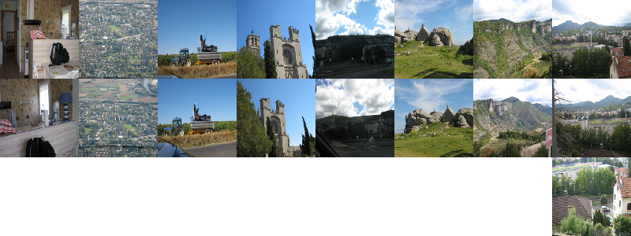

About
=====

Package for clustering images by content. We use a pre-trained deep
convolutional neural network to calculate image fingerprints, which are then
used to cluster similar images.

Usage
=====

The package is designed as a library. Here is what you can do:

.. code:: python

    from imagecluster import calc as ic
    from imagecluster import postproc as pp

    # Create image database in memory. This helps to feed images to the NN model
    # quickly.
    ias = ic.image_arrays('pics/', size=(224,224))

    # Create Keras NN model.
    model = ic.get_model()

    # Feed images through the model and extract fingerprints (feature vectors).
    fps = ic.fingerprints(ias, model)

    # Optionally run a PCA on the fingerprints to compress the dimensions. Use a
    # cumulative explained variance ratio of 0.95.
    fps = ic.pca(fps, n_components=0.95)

    # Run clustering on the fingerprints.  Select clusters with similarity index
    # sim=0.5
    clusters = ic.cluster(fps, sim=0.5)

    # Create dirs with links to images. Dirs represent the clusters the images
    # belong to.
    pp.make_links(clusters, 'pics/imagecluster/clusters')

    # Plot images arranged in clusters.
    pp.visualize(clusters, ias)

See also ``imagecluster.main.main()``. It does the same as the code above, but
also saves/loads the image database and the fingerprints to/from disk, such
that you can re-run the clustering and post-processing again without
re-calculating fingerprints.

Example session:

.. code:: python

    >>> from imagecluster import main
    >>> main.main('pics/', sim=0.5, vis=True)
    no fingerprints database pics/imagecluster/fingerprints.pk found
    create image array database pics/imagecluster/images.pk
    pics/140301.jpg
    pics/140601.jpg
    pics/140101.jpg
    pics/140400.jpg
    pics/140801.jpg
    [...]
    running all images through NN model ...
    pics/140301.jpg
    pics/140503.jpg
    pics/140601.jpg
    pics/140901.jpg
    pics/140101.jpg
    [...]
    clustering ...
    #images : #clusters
    2 : 7
    3 : 1
    #images in clusters total:  17
    cluster dir: pics/imagecluster/clusters

If you run this again on the same directory, only the clustering (which is very
fast) and the post-processing (links, visualization) will be repeated.

For this example, we use a very small subset of the `Holiday image dataset
<holiday_>`_ (25 images (all named 140*.jpg) of 1491 total images in the
dataset).

Have a look at the clusters (as dirs with symlinks to the relevant files):

.. code:: sh

    $ tree pics/imagecluster/clusters/
    pics/imagecluster/clusters/
    ├── cluster_with_2
    │   ├── cluster_0
    │   │   ├── 140100.jpg -> /path/to/pics/140100.jpg
    │   │   └── 140101.jpg -> /path/to/pics/140101.jpg
    │   ├── cluster_1
    │   │   ├── 140600.jpg -> /path/to/pics/140600.jpg
    │   │   └── 140601.jpg -> /path/to/pics/140601.jpg
    │   ├── cluster_2
    │   │   ├── 140400.jpg -> /path/to/pics/140400.jpg
    │   │   └── 140401.jpg -> /path/to/pics/140401.jpg
    │   ├── cluster_3
    │   │   ├── 140501.jpg -> /path/to/pics/140501.jpg
    │   │   └── 140502.jpg -> /path/to/pics/140502.jpg
    │   ├── cluster_4
    │   │   ├── 140000.jpg -> /path/to/pics/140000.jpg
    │   │   └── 140001.jpg -> /path/to/pics/140001.jpg
    │   ├── cluster_5
    │   │   ├── 140300.jpg -> /path/to/pics/140300.jpg
    │   │   └── 140301.jpg -> /path/to/pics/140301.jpg
    │   └── cluster_6
    │       ├── 140200.jpg -> /path/to/pics/140200.jpg
    │       └── 140201.jpg -> /path/to/pics/140201.jpg
    └── cluster_with_3
        └── cluster_0
            ├── 140801.jpg -> /path/to/pics/140801.jpg
            ├── 140802.jpg -> /path/to/pics/140802.jpg
            └── 140803.jpg -> /path/to/pics/140803.jpg

So there are some clusters with 2 images each, and one with 3 images. Lets look
at the clusters:

Here is the result of using a larger subset of 292 images from the same dataset.

.. image:: doc/clusters_many.png

Methods
=======

Clustering and similarity index
-------------------------------

We use `hierarchical clustering <hc_>`_ (``calc.cluster()``), which compares
the image fingerprints (4096-dim vectors) using a distance metric and produces
a `dendrogram <dendro_>`_ as an intermediate result. This shows how the images
can be grouped together depending on their similarity (y-axis).

.. image:: doc/dendrogram.png

One can now cut through the dendrogram tree at a certain height (``sim``
parameter 0...1, y-axis) to create clusters of images with that level of
similarity. ``sim=0`` is the root of the dendrogram (top in the plot) where
there is only one node (= all images in one cluster). ``sim=1`` is equal to the
end of the dendrogram tree (bottom in the plot), where each image is its own
cluster. By varying the index between 0 and 1, we thus increase the number of
clusters from 1 to the number of images. However, note that we only report
clusters with at least 2 images, such that ``sim=1`` will in fact produce no
results at all (unless there are completely identical images).

Image fingerprints
------------------

The task of the fingerprints (feature vectors) is to represent an image's
content (mountains, car, kitchen, person, ...). Deep convolutional neural
networks trained on many different images have developed an internal
representation of objects in higher layers, which we use for that purpose.

To this end, we use a pre-trained NN (VGG16_ as implemented by Keras_). The
weights will be downloaded *once* by Keras automatically upon first import and
placed into ``~/.keras/models/``. The network was trained on ImageNet_ and is
able to categorize images into 1000 classes (the last layer has 1000 nodes). We
use (`thanks for the hint! <alexcnwy_>`_) the activations of the second to last
fully connected layer ('fc2', 4096 nodes) as image fingerprints (numpy 1d array
of shape ``(4096,)``) by default.

Quality of clustering & parameters to tune
------------------------------------------

You may have noticed that in the example above, only 17 out of 25 images are
put into clusters. The others are not assigned to any cluster. Technically they
are in clusters of size 1, which we don't report by default (unless you use
``calc.cluster(..., min_csize=1)``). One can now start to lower ``sim`` to
find a good balance of clustering accuracy and the tolerable amount of
dissimilarity among images within a cluster.

Also, the parameters of the clustering method itself are worth tuning. ATM, we
expose only some in ``calc.cluster()``. We tested several distance metrics and
linkage methods, but this could nevertheless use a more elaborate evaluation.
See ``calc.cluster()`` for "method", "metric" and "criterion" and the scipy
functions called. If you do this and find settings which perform much better --
PRs welcome!

Additionally, some other implementations do not use any of the inner fully
connected layers as features, but instead the output of the last pooling
layer (layer 'flatten' in Keras' VGG16). We tested that briefly (see
``get_model(... layer='fc2')`` or ``main(..., layer='fc2')`` and found our
default 'fc2' to perform well enough. 'fc1' performs almost the same, while
'flatten' seems to do worse. But again, a quantitative analysis is in order.

PCA: Because of the `Curse of dimensionality <curse_>`_, it may be helpful to
perform a PCA on the fingerprints before clustering to reduce the feature
vector dimensions to, say, a few 100, thus making the distance metrics used in
clustering more effective. However, our tests so far show no substantial change
in clustering results, in accordance to what `others have found
<gh_beleidy_>`_. See ``examples/example_api.py`` and ``calc.pca()``.

Tests
=====

See ``imagecluster/tests/``. Use a test runner such as ``nosetests`` or
``pytest``.

Install
=======

.. code:: sh

    $ pip3 install -e .

or if you have the ``requirements.txt`` already installed (e.g. by your system's
package manager)

.. code:: sh

    $ pip3 install -e . --no-deps

Related projects
================

* https://artsexperiments.withgoogle.com/tsnemap/
* https://github.com/YaleDHLab/pix-plot
* https://github.com/beleidy/unsupervised-image-clustering
* https://github.com/zegami/image-similarity-clustering
* https://github.com/sujitpal/holiday-similarity

.. _VGG16: https://arxiv.org/abs/1409.1556
.. _Keras: https://keras.io
.. _ImageNet: http://www.image-net.org/
.. _alexcnwy: https://github.com/alexcnwy
.. _hc: https://en.wikipedia.org/wiki/Hierarchical_clustering
.. _dendro: https://en.wikipedia.org/wiki/Dendrogram
.. _holiday: http://lear.inrialpes.fr/~jegou/data.php
.. _curse: https://en.wikipedia.org/wiki/Curse_of_dimensionality
.. _gh_beleidy: https://github.com/beleidy/unsupervised-image-clustering
