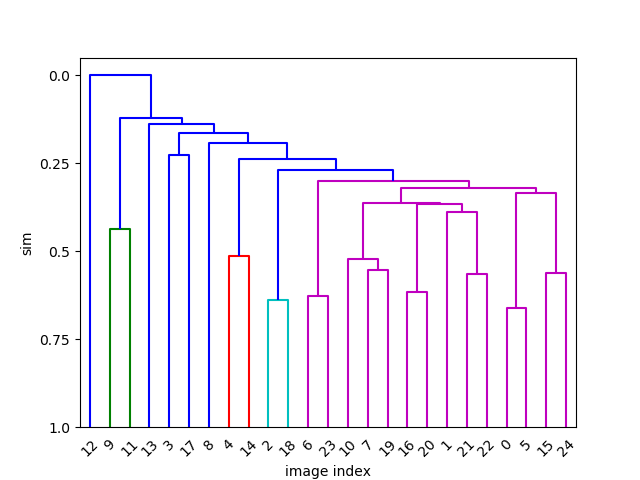

.. include:: refs.rst

.. _methods:

Methods
=======

Representation of image content: fingerprints
---------------------------------------------

The task of fingerprints (feature vectors) is to represent an image's
content (mountains, car, kitchen, person, ...). Deep convolutional neural
networks trained on many different images have developed an internal
representation of objects in higher layers, which we use for that purpose.

To this end, we use a pre-trained NN (VGG16_ as implemented by Keras_). The
weights will be downloaded *once* by Keras automatically upon first import and
placed into ``~/.keras/models/``. The network was trained on ImageNet_ and is
able to categorize images into 1000 classes (the last layer has 1000 nodes). We
use (`thanks for the hint! <alexcnwy_>`_) the activations of the second to last
fully connected layer ('fc2', 4096 nodes) as image fingerprints (numpy 1d array
of shape ``(4096,)``) by default.

.. _time_scaling:

Content and time distance
-------------------------

Image fingerprints represent content. Clustering based on content ignores time
correlations. Say we have two images of some object that look similar. Thus
their fingerprints are similar (have small distance in feature space) and so
they will
be put into the same cluster. However, they might be in fact pictures of
different objects, taken at different times -- which is our original holiday
image use case (e.g. two images of a church from different cities, taken on
separate trips). In this case, we want the images to end up in different
clusters. We have a feature to mix content distance :math:`d_c` (from
fingerprints) and time distance :math:`d_t` (from timestamps or EXIF tags) such
that

.. math::

    d = \alpha\,d_t + (1 - \alpha)\,d_c\:.

One can thus do pure content-based clustering (:math:`\alpha=0`) or pure time-based
(:math:`\alpha=1`). The effect of the mixing is that fingerprint points representing
content get pushed further apart when the corresponding images' time distance
is large. That way, we achieve a transparent addition of time information w/o
changing the clustering method. See :func:`~imagecluster.calc.cluster`'s
``alpha`` and ``timestamps`` parameters.

.. _cluster_sim_index:

Clustering and similarity index
-------------------------------

We use `hierarchical clustering <hc_>`_ (:func:`~imagecluster.calc.cluster`),
which compares the image fingerprints (4096-dim vectors, possibly scaled by
time distance) using a distance metric and produces a `dendrogram <dendro_>`_
as an intermediate result. This shows how the images can be grouped together
depending on their similarity (y-axis).

One can now cut through the dendrogram tree at a certain height (``sim``
parameter 0...1, y-axis) to create clusters of images with that level of
similarity. ``sim=0`` is the root of the dendrogram (top in the plot) where
there is only one node (= all images in one cluster). ``sim=1`` is equal to the
end of the dendrogram tree (bottom in the plot), where each image is its own
cluster. By varying the index between 0 and 1, we thus increase the number of
clusters from 1 to the number of images. However, note that we only report
clusters with at least 2 images, such that ``sim=1`` will in fact produce no
results at all (unless there are completely identical images).

.. _cluster_params:

Quality of clustering & parameters to tune
------------------------------------------

Apart from the obvious ``sim`` and ``alpha`` parameters, the parameters of
the clustering method itself are worth tuning. ATM, we expose only some in
:func:`~imagecluster.calc.cluster`. We tested several distance metrics and
linkage methods, but this could nevertheless use a more elaborate evaluation.
See :func:`~imagecluster.calc.cluster` for `method`, `metric` and `criterion`
and the scipy functions called. If you do this and find settings which perform
much better -- PRs welcome!

Additionally, some other implementations do not use any of the inner fully
connected layers as features, but instead the output of the last pooling layer
(layer 'flatten' in Keras' VGG16). We tested that briefly (see
``calc.get_model(... layer='fc2')``) and found our default 'fc2' to perform
well enough. 'fc1' performs almost the same, while 'flatten' seems to do worse.
But again, a quantitative analysis is in order.

PCA: Because of the `Curse of dimensionality <curse_>`_, it may be helpful to
perform a PCA on the fingerprints before clustering to reduce the feature
vector dimensions to, say, a few 100, thus making the distance metrics used in
clustering more effective. However, our tests so far show no substantial change
in clustering results, in accordance to what `others have found
<gh_beleidy_>`_. See ``examples/example_api.py`` and
:func:`~imagecluster.calc.pca`.

Performance
-----------

The bottleneck in all calculations is :func:`~imagecluster.calc.fingerprints`,
all other operations have negligible relative cost. Especially clustering is
very fast.

Fingerprints calculation puts each image thru the TensorFlow NN model (VGG16).
Due to technical foo (see :mod:`~imagecluster.calc` for details, PRs welcome!)
we cannot paralellize over images using ``multiprocessing``. Instead we do a
serial loop over images and leverage TensorFlow's threading which which is on
by default. On low core counts, this does indeed scale OK.
