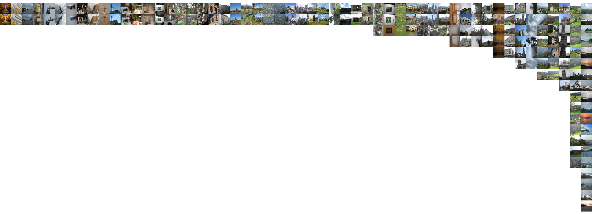

.. include:: refs.rst

Usage
=====

Minimal example
---------------

The package is designed as a library. Here is a minimal example of what you can
do (``examples/example_api_minimal.py``):

.. literalinclude:: ../../../examples/example_api_minimal.py

Have a look at the clusters, represented as dirs with symlinks to the relevant
files (by :func:`~imagecluster.postproc.make_links`).

.. code:: sh

    $ tree pics/imagecluster/clusters
    pics/imagecluster/clusters
    ├── cluster_with_2
    │   ├── cluster_0
    │   │   ├── 140700.jpg -> /path/to/pics/140700.jpg
    │   │   └── 140701.jpg -> /path/to/pics/140701.jpg
    │   ├── cluster_1
    │   │   ├── 140100.jpg -> /path/to/pics/140100.jpg
    │   │   └── 140101.jpg -> /path/to/pics/140101.jpg
    │   ├── cluster_2
    │   │   ├── 140600.jpg -> /path/to/pics/140600.jpg
    │   │   └── 140601.jpg -> /path/to/pics/140601.jpg
    │   ├── cluster_3
    │   │   ├── 140400.jpg -> /path/to/pics/140400.jpg
    │   │   └── 140401.jpg -> /path/to/pics/140401.jpg
    │   ├── cluster_4
    │   │   ├── 140000.jpg -> /path/to/pics/140000.jpg
    │   │   └── 140001.jpg -> /path/to/pics/140001.jpg
    │   ├── cluster_5
    │   │   ├── 140501.jpg -> /path/to/pics/140501.jpg
    │   │   └── 140502.jpg -> /path/to/pics/140502.jpg
    │   ├── cluster_6
    │   │   ├── 140300.jpg -> /path/to/pics/140300.jpg
    │   │   └── 140301.jpg -> /path/to/pics/140301.jpg
    │   └── cluster_7
    │       ├── 140200.jpg -> /path/to/pics/140200.jpg
    │       └── 140201.jpg -> /path/to/pics/140201.jpg
    └── cluster_with_3
        └── cluster_0
            ├── 140801.jpg -> /path/to/pics/140801.jpg
            ├── 140802.jpg -> /path/to/pics/140802.jpg
            └── 140803.jpg -> /path/to/pics/140803.jpg

Here is a visual representation made by :func:`~imagecluster.postproc.visualize`.

.. image:: ../_static/clusters.png
   :width: 100%

So there are some clusters with 2 images each, and one with 3 images.

For this example, we use a very small subset of the `Holiday image dataset
<holiday_>`_ (25 images (all named 140*.jpg) of 1491 total images in the
dataset). See ``examples/inria_holiday.sh`` for how to select such a subset:

.. literalinclude:: ../../../examples/inria_holiday.sh

.. code:: sh

    $ /path/to/imagecluster/examples/inria_holiday.sh jpg/140*

Here is the result of using a larger subset of 292 images from the same dataset
(``inria_holiday.sh jpg/14*``):

You may have noticed that in the 25-image example above, only 19 out of 25 images are
put into clusters. The others are not assigned to any cluster. Technically they
are in clusters of size 1, which we don't report by default (unless you use
``calc.cluster(..., min_csize=1)``). One can now start to lower ``sim`` to find
a good balance of clustering accuracy and the tolerable amount of dissimilarity
among images within a cluster. See :ref:`cluster_sim_index`.

Detailed example
----------------

This example shows all low-level functions and also shows how to use time
distance scaling. Use the latter if you (i) find that pure content-based
clustering throws similar but temporally uncorrelated images in the same cluster
and (ii) you have meaningful timestamp data such as EXIF tags or correct file
timestamps (watch out for those when copying files around, use ``cp -a`` or
``rsync -a``). See :ref:`time_scaling`.

.. literalinclude:: ../../../examples/example_api_detailed.py
